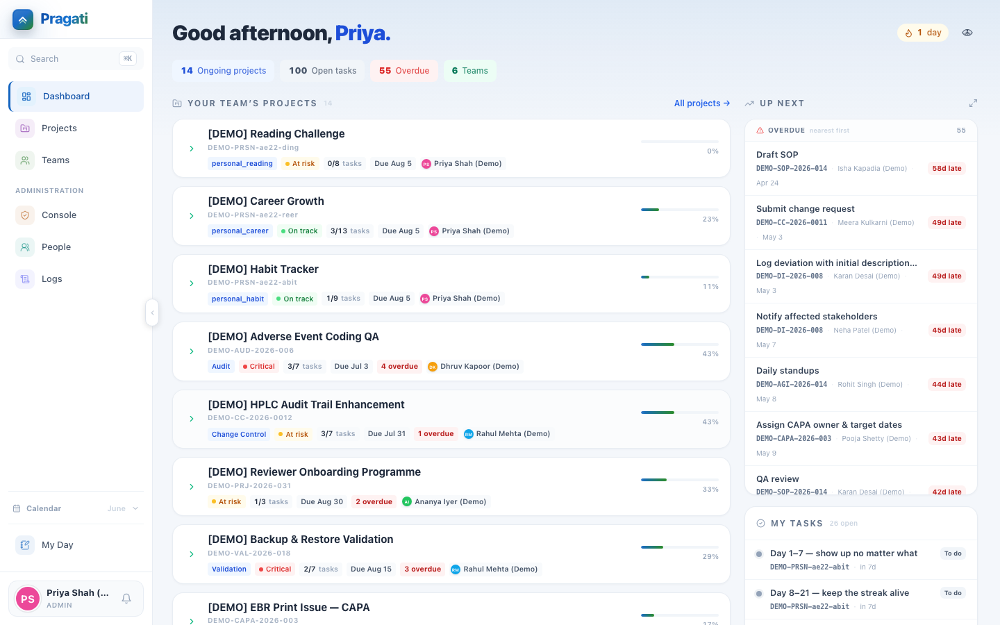
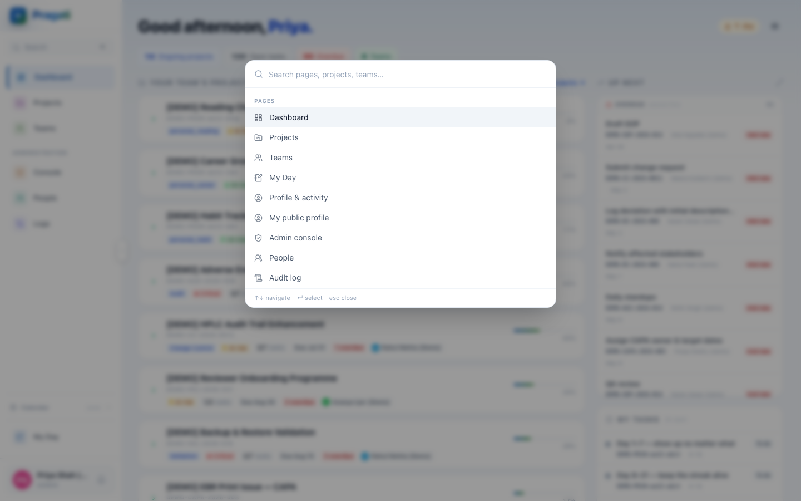
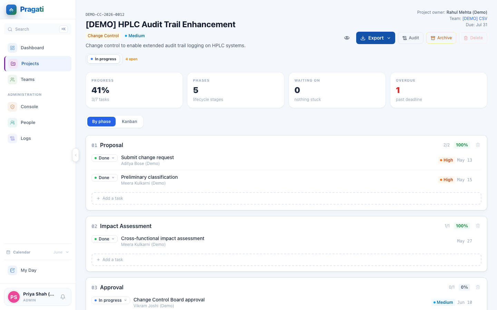
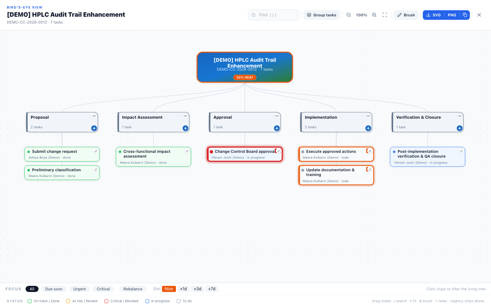
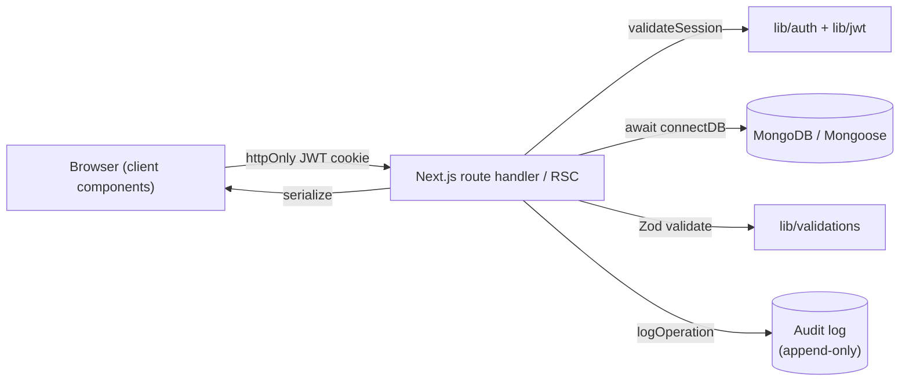

# Pragati

> Built from first principles: if everyone could see the whole board, most status meetings wouldn't need to exist. So everyone sees the whole board — one organisation, one living tree — and the system learns how your people actually deliver.

[](https://github.com/abhipatelz/Pragati/actions/workflows/ci.yml)
[](#stack)
[](./docs/ARCHITECTURE.md)
[](./LICENSE)

**[Live app](https://pragatialm.vercel.app)** — sign in with a read-only demo account, no setup required:

| Email | Password | Role |
| --- | --- | --- |
| `demo.lead@pragati.local` | `Demo@1234` | Team Lead (best first look) |
| `demo.ic@pragati.local` | `Demo@1234` | Individual Contributor |

These are seeded demo accounts on a public demo workspace — don't put anything sensitive in them. They're exempt from the brute-force lockout (their password is public, so the lock would only let a passer-by take the demo down) and self-heal on the next correct sign-in, so the link above always works. Full seed details: [`docs/DEMO_ENVIRONMENT.md`](./docs/DEMO_ENVIRONMENT.md).

## 60 seconds, in motion


<table>
<tr>
<td width="50%"><br/><sub>Dashboard — up next, team projects, momentum</sub></td>
<td width="50%"><br/><sub>Cmd/Ctrl+K command palette — navigate, search, quick-add a task</sub></td>
</tr>
<tr>
<td width="50%"><br/><sub>Project detail — lifecycle phases or Kanban, your choice</sub></td>
<td width="50%"><br/><sub>Bird's-eye view — the whole project as one living tree</sub></td>
</tr>
</table>

## What it is

**One promise: everyone sees the whole board.** Question the usual requirement — *why does a contributor only get to see their own slice?* There's no good reason, so here they don't. Every person — contributor, lead, or admin — gets a bird's-eye view of everything moving in their team, plus a private space only they can see. Born out of pharma QA-IT, so it borrows GxP-style audit-trail and lifecycle patterns; the model itself is universal. Invite-only — no public sign-up, no marketing funnel.

| Role | What they see |
| --- | --- |
| **Contributor** | Their own tasks, their My Day, and truly private personal projects (invisible to everyone — including admins). |
| **Team Lead** | Their teams, projects and tasks; assigns work; tracks progress. |
| **Admin** | Full workspace control, user management, operations + audit log. |
| **Master Admin** (dormant) | Cross-tenant provisioning, when multi-tenant runtime is enabled. |

## Engineering at a glance

Solo-built, in production, not a tutorial clone. The numbers below come straight from the repo — `npm test`, `find`, `git log` — not from a pitch deck. If you can't measure it, it's just an opinion.

| | |
| --- | --- |
| **~57,000** lines of TypeScript | **92** API route handlers |
| **18** Mongoose models | **43** React components |
| **233** unit tests + **5** Playwright e2e specs, all green | **600+** commits of real iteration history |
| Typecheck · lint · test · build gated on every push ([`ci.yml`](.github/workflows/ci.yml)) | Deployed on Vercel with scheduled cron jobs (health check, daily digest) |

A few decisions worth a closer look during a code review. Each one started by questioning a requirement everybody else takes for granted:

- **A rule-based decision engine, deliberately not an LLM.** The default move is "add AI." Questioned and rejected: QA severity triage, slip-risk prediction, and delivery forecasting (`src/lib/ai/*`) are hand-calibrated, fully deterministic, and unit-tested — every score traces to a line of code, not a model weight. You can't debug a weight; you can debug a line. See [`src/lib/ai/slipRisk.ts`](./src/lib/ai/slipRisk.ts) and [`src/lib/ai/deliveryForesight.ts`](./src/lib/ai/deliveryForesight.ts).
- **One capability matrix drives the UI and the API.** [`src/lib/permissions.ts`](./src/lib/permissions.ts) is the single source of truth for who can do what — imported by route handlers and components alike, so the two can never disagree.
- **A natural-language quick-add parser with zero dependencies.** Typing "Ship the QA report urgent tomorrow" into the command palette extracts a due date, priority, and clean title — one small regex-driven module ([`src/lib/quickAddParse.ts`](./src/lib/quickAddParse.ts)), fully unit-tested, no NLP library.
- **A scaling story that's mostly already built.** [`docs/SCALING.md`](./docs/SCALING.md) walks through the tenant-as-shard data model and exactly which env var flips on each growth lever — most of it shipped and dormant, not hypothetical.

## How it's put together



Reads go straight from server components to Mongoose data builders; mutations flow through validated API route handlers that write an audit entry on every change. Full breakdown, component tree, and the role/capability matrix: [`docs/ARCHITECTURE.md`](./docs/ARCHITECTURE.md). How this shape scales from one workspace to many tenants: [`docs/SCALING.md`](./docs/SCALING.md).

## Highlights

- **Admin console** — `/admin` puts the whole workspace on one server-rendered page: people/team/project/task counts, an attention queue (locked accounts, pending invites, forced password resets), the latest audit activity, and one-click entry into every admin surface. Admins see *everything* (every team, every shared project) — except personal projects, which stay private to their owners by design. One capability matrix (`src/lib/permissions.ts`) drives both the UI and the API, so what a role sees is exactly what it can do.
- **Command palette (⌘K)** — jump to any page or admin surface, run quick actions, or live-search projects and teams without leaving the keyboard. Includes **Quick Add**: type free text like "Renew SSL cert urgent tomorrow" and a small deterministic parser pulls out the due date, priority, and a clean title — no LLM, same auditable philosophy as the QA engine below.
- **Bird's-eye view** — a full-screen, interactive SVG tree of `team → project → task → assignee`. Click any card (or the connector leading to it) to expand or hide its branch, drag cards to rearrange, sketch over the canvas with the brush, quick-edit assignee/TCD inline, and export the exact on-screen view as PDF, SVG, or image. Opens from the dashboard, team detail, or project detail page.
- **Early warning, learned per person** — the dashboard quietly flags open work that is *likely to miss its date* before it does: a tiny model learns each person's real median cycle time and past-due rate from their own history and weighs it against the runway left and competing open work. No external AI service, no extra queries — computed in-process over data already loaded, every score traceable to a line of code (`src/lib/ai/slipRisk.ts`).
- **Your reference scheme, not ours** — every project carries a user-pickable reference type plus your own number, shown everywhere instead of the system-generated code. Your numbering scheme survives the tool; the tool doesn't impose one.
- **Owner-gated deletions** — tasks and phases can only be deleted by the **project owner** (and workspace admins). Leads manage work; only the owner can destroy it. Deleting a phase never deletes its tasks — they move to *Unphased*, and the action lands in the audit trail.
- **Lifecycle templates** — a library of structured workflows (engineering change, incident management, audits, validation, sprints, training programs, vendor qualification, …) plus Personal templates for ICs — or define your own.
- **Append-only audit trail** — every record change carries who, what, when, and why; there's no update/delete route for an audit row by application design. Personal projects never enter the cross-user log. Editing a project's reference number writes a before/after record.
- **Mind map on My Day** — a personal node-link canvas for capturing thoughts before they become tasks. Owner-private, autosaves per user.
- **Whiteboard & Notes** — a full-screen sketch surface and a full-screen note list, both reachable from a FAB on My Day, both owner-private.
- **Public profiles** — a within-workspace profile at `/<username>` with a contribution heatmap, an optional GitHub link, and Follow / Unfollow for colleagues.
- **Sidebar calendar** — a compact month grid pinned above My Day, dotted with what's due (mine / team / overdue) and a hover card listing the day's work.
- **Dashboard "Up Next"** — colour-coded urgency pills (overdue / today / ≤2d / future) on every due-row, with filter chips (week / next week / month / until-date).
- **Activity graph** — GitHub-style contribution heatmap with role-based achievements (Milestone Achiever, On-Time Streak, Project Finisher, Mentor, Load Balancer, …).
- **Reports** — Excel (interactive), PDF, CSV, HTML exports for both projects and teams. Print preview before save.
- **Productivity touches** — resizable sidebar, global keyboard shortcuts (`⌘K` for the command palette, `G D/P/T/M` to navigate, `?` for the shortcut sheet), custom team avatars, and per-page loading skeletons that mirror each real layout.
- **A login screen that earns its pixels** — an unattributed line on doing the work, drawn from Elon Musk and the books he recommends, rotated so it never repeats on a device until the whole library has cycled. There was once a live-feed CMS behind it (an API route, a memo cache, an env var) to swap quotes without a redeploy. It was deleted: the words ship with the binary now. The best part is no part.
- **AI, deep but minimal** — the rule-based engine decides everything (an architectural invariant); Gemini may only *rephrase* the already-decided Morning Brief headline (one cached call per user per day, instant fallback without a key). Plus the conversational Copilot and mind-map→tasks suggestions.
- **Daily rundown, four channels, free forever** — every user gets a role-aware **Morning Brief** (contributors: what's on my plate; leads: team pulse; admins: workspace rundown) rendered on the dashboard, as an optional **Web Push** notification (VAPID — no vendor, no cost), as a personal **calendar feed** (subscribe once in Outlook/Google/Apple), and as an opt-in **08:30 IST email** capped to the provider's free tier. Mail is provider-agnostic (`MAIL_PROVIDER=brevo|resend|webhook`) so an org can bring its own relay. See [Daily email digest](#daily-email-digest) and [`docs/SCALING.md`](./docs/SCALING.md).

## Security & data integrity

- **Hand-rolled auth** — JWT + bcrypt + httpOnly cookie, one active session per user, idle auto-logout, brute-force lockout.
- **Credential reuse prevention** — passwords and Quick PINs cannot repeat any of the last three used, enforced server-side on every change.
- **Password-confirmed sign-offs** — controlled status changes and sensitive account edits require password re-entry plus a reason, recorded verbatim in the audit trail. This is re-authentication plus a recorded reason, not a claim of conformance to any specific e-signature regulation.
- **Least-privilege destruction** — project deletion requires owner/admin + password re-auth; task and phase deletion is project-owner-only.
- **Read-through cache** — optional Upstash Redis layer on hot aggregations (dashboard, projects, people), inert when the env vars are absent.

> **On the GxP language above:** Pragati borrows audit-trail and lifecycle *shapes* that are common in regulated pharma QA-IT (who/what/when/why on every mutation, append-only by omitting any update/delete route, ownership-gated destruction). It has **not** been through a formal 21 CFR Part 11 validation exercise — there's no qualification protocol, no vendor audit, no signed validation report. Treat "GxP-inspired" as the accurate claim, not "Part 11-certified."

## Run locally

```bash
cp .env.example .env.local        # set MONGODB_URI, JWT_SECRET, APP_URL
npm install
npm run dev                       # http://localhost:3000
```

For an isolated dev DB without Atlas:

```bash
USE_IN_MEMORY_MONGO=true npm run dev
```

> The in-memory mode downloads a Mongo binary on first start. If MongoDB's archive 403s a particular version, override with `MONGOMS_VERSION=7.0.7` (or any [available release](https://www.mongodb.com/download-center/community/releases/archive)).

## Demo data

Drop a believable workspace into your existing database with one command. The
seeded workspace is themed as an Elon-style engineering org — SpaceX, Tesla and
xAI teams (Starbase Engineering, Raptor Propulsion, Tesla Powertrain, Autopilot
& AI, Starlink, Gigafactory Operations) running programs like Raptor 3, the 4680
cell line, FSD v13 and a Starship flight-software release.

```bash
npm run seed:demo                 # 16 users, 6 teams, 12 projects, mixed task statuses
npm run seed:demo -- --clean      # wipe demo records (real data untouched)
```

Demo accounts (password `Demo@1234`):

| Email | Role |
| --- | --- |
| `demo.lead@pragati.local` | Team Lead — Elon Musk (Demo), best first look |
| `demo.ic@pragati.local` | Individual Contributor — a propulsion engineer |
| `demo.<handle>@pragati.local` | 14 supporting engineers |

Details: [`docs/DEMO_ENVIRONMENT.md`](./docs/DEMO_ENVIRONMENT.md).

## Production

Live at **[pragatialm.vercel.app](https://pragatialm.vercel.app)**, deployed on Vercel (`bom1` / Mumbai, co-located with the Atlas cluster), with a scheduled health check and daily-digest cron ([`vercel.json`](./vercel.json)) plus a GitHub Actions production smoke test.

Full launch runbook (env vars, smoke test, uptime monitor, rollback): [`docs/LAUNCH_CHECKLIST.md`](./docs/LAUNCH_CHECKLIST.md).

Performance budgets and profiling guide: [`docs/PERFORMANCE.md`](./docs/PERFORMANCE.md).

How this scales — tenant-as-shard data model, the levers per growth tier, and the
rules that keep per-request work O(viewer): [`docs/SCALING.md`](./docs/SCALING.md).

## Daily email digest

An opt-in morning email of the tasks each user has due that day, sent at **08:30 IST**
(`0 3 * * *` UTC — see `vercel.json`). Everything is inert until configured, so the
app builds and runs without any of these.

1. **Email provider (free).** Create a [Brevo](https://www.brevo.com) account →
   *SMTP & API → API Keys* for `BREVO_API_KEY`, and verify a sender under *Senders*
   for `BREVO_SENDER_EMAIL`. No SMTP, no domain DNS required to start.
2. **Vercel env vars** (Project → Settings → Environment Variables):
   `BREVO_API_KEY`, `BREVO_SENDER_EMAIL`, `BREVO_SENDER_NAME` (optional),
   `CRON_SECRET` (`openssl rand -hex 32` — required for the scheduled send to run),
   and `APP_URL` (absolute site URL for in-email links). Redeploy.
3. **Collect addresses.** A real email is mandatory when an admin adds a user; for
   existing accounts, set it from **People → Edit → Notification email**.
4. **Tune & test.** As admin, open **Settings → Daily email — workspace settings** to
   choose what each digest contains, add an optional intro note, and **Send test to
   my email**. The panel shows a live setup checklist of what's still missing.

Each user controls whether they receive it from **Settings → Daily task email** (off by
default). The digest is a read-only projection of existing task data — it creates no
records and never touches the audit trail.

## Stack

Next.js 14 (App Router) · TypeScript · MongoDB / Mongoose · Zod · Tailwind · JWT + bcrypt + httpOnly cookie. No NextAuth, no Prisma, no third-party identity provider — by design, so every line of the auth and persistence path is owned, auditable code.

Server-rendered detail pages with streaming Suspense skeletons; an Edge middleware cookie pre-filter for auth; an optional Upstash Redis read-through cache on hot aggregations (inert without env vars); and Vercel serverless functions pinned to `bom1` (Mumbai) to co-locate with the Atlas `ap-south-1` cluster.

Architecture deep-dive: [`docs/ARCHITECTURE.md`](./docs/ARCHITECTURE.md). Growth plan to web scale: [`docs/SCALING.md`](./docs/SCALING.md).

## Project structure

```
src/
├── app/                      # Next.js App Router
│   ├── (authed)/             # authenticated surfaces (shared AppShell layout)
│   │   ├── page.tsx          # dashboard
│   │   ├── projects/         # list · new · [id] detail
│   │   ├── teams/             # list · [id] detail
│   │   ├── people/           # admin-only user directory
│   │   ├── my-day/           # personal tasks + mind map + whiteboard + notes
│   │   ├── settings/         # profile, security, preferences
│   │   ├── audit/            # immutable operations log
│   │   └── [username]/       # public-within-workspace profile
│   ├── api/                  # route handlers (auth, projects, tasks, teams, users…)
│   ├── login/                # unauthenticated entry
│   └── globals.css           # Tailwind layer + design tokens
├── components/               # UI — AppShell, CommandPalette, BirdsEyeView, SidebarCalendar, ProfileView…
├── lib/                      # server + client logic
│   ├── ai/                   # rule-based triage + KB (never an LLM on the scoring path)
│   ├── flow/                 # Flow Signal meaningful-activity engine
│   ├── client/               # browser-only helpers (api client, hooks)
│   ├── auth.ts               # JWT sign/verify, sessions, bcrypt, RBAC helpers
│   ├── validations.ts        # central Zod schemas — the API boundary contract
│   ├── quickAddParse.ts      # free-text → task draft parser (command palette)
│   ├── cache.ts              # optional Upstash read-through cache
│   └── serialize.ts          # Mongoose doc → JSON-safe shapes
├── models/                   # Mongoose schemas (User, Team, Project, Task, AuditLog…)
└── middleware.ts             # Edge cookie pre-filter for authed routes

docs/                         # ARCHITECTURE · PERFORMANCE · LAUNCH_CHECKLIST · E2E · ROLLOUT…
scripts/                      # operator + seed CLIs (tsx)
tests/                        # unit (node:test) + e2e (Playwright)
```

## Architectural invariants

These constraints are not suggestions:

- **QA triage engine** stays rule-based — never an LLM call on the scoring path.
- **Auth** stays hand-rolled (JWT + bcrypt + httpOnly cookie). No NextAuth, Clerk, Auth0, Supabase Auth.
- **Persistence** stays Mongoose. No Prisma, Drizzle, TypeORM.
- **API bodies** validate through the central Zod schemas in `src/lib/validations.ts`.
- **Destructive actions** (project / task / phase deletion) are ownership-gated and audited.

Don't relax those without talking to the QA lead first.

## Scripts

```bash
npm run dev               # local dev server
npm run build             # production build
npm run typecheck         # tsc --noEmit
npm run lint              # next lint
npm run format            # prettier --write on src, scripts, tests
npm run e2e               # Playwright suite (needs a browser + Mongo)
npm run smoke-prod <url>  # read-only smoke test against a live deployment

# Unit tests run on the Node built-in runner via tsx (no DB / no browser):
npm test

# Operator scripts
npm run set-admin <email>            # promote a user to admin
npm run set-password <email> <pw>    # bootstrap a password from CLI
npm run cleanup-users                # drop everyone not from the invite flow
npm run backfill-usernames           # backfill handles on legacy accounts
npm run migrate-roles                # migrate legacy pm/employee role aliases
npm run seed                         # canonical seed
npm run seed:demo                    # demo workspace seed (see Demo data above)
```

## Testing

Two layers, both runnable from a clean checkout:

- **Unit** (`npm test`) — 233 zero-infra tests on the Node built-in runner via `tsx`. Covers the rule-based triage/quality-signal math (clustering + cosine similarity), the Flow Signal meaningful-activity engine, the daily digest, and the quick-add parser. No database, no browser.
- **End-to-end** (`npm run e2e`) — Playwright drives auth, dashboard, projects, teams and core UX flows against a real server backed by an in-memory Mongo. See [`docs/E2E.md`](./docs/E2E.md).

CI runs typecheck, lint, the full unit suite, and a production build on every push ([`.github/workflows/ci.yml`](.github/workflows/ci.yml)) — currently green, badge above is live, not decorative.

## Multi-tenant (dormant)

Pragati ships with a scaffolded master-admin / database-per-tenant runtime, currently inactive. The default deployment runs as a single tenant named `default`. To enable:

1. Set `PRAGATI_MULTI_TENANT=true` in the hosting environment.
2. Provision a fresh Mongo database for the new tenant.
3. Insert the corresponding `tenants` document (slug, dbName, customDomain, plan, quotas).
4. Promote one user to the `master_admin` role.

The `/master-admin` console renders a status board explaining the steps until the runtime is active.

## License

[MIT](./LICENSE)
